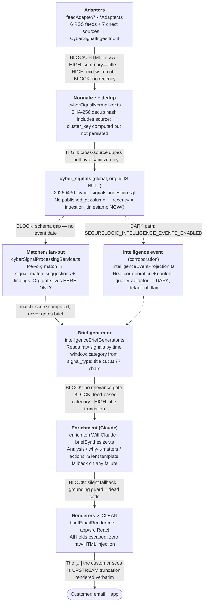

# Intelligence Quality Program — Phase 1 Audit

> **Status:** Launch-blocking · **Phase 1 · Read-only** · Target **Jul 15** · Baseline **develop `45fb9129`** · Scope **Intelligence pipeline (not EAR)**
>
> This is the permanent Phase 1 governing document for the Intelligence Quality Program (IQP). It is a read-only, evidence-first audit of the full lifecycle from public source to customer-facing finding. Every defect is traced to a specific line of code. **No code, migration, commit, PR, or feature-flag change was made in Phase 1.** Conclusions in this document are final for Phase 1 and must not be altered without a superseding review.

Evidence was produced by six parallel read-only audits — adapters/KEV, canonical contract, relevance/classification, enrichment, renderers, observability — every claim anchored to `file:line` in the source at the baseline SHA.

---

## A. Executive summary

Six parallel audits converged on one structural conclusion: SecureLogic ingests public news and vulnerability feeds, applies almost no per-organization relevance or content-quality gate, and renders the raw result. The "canonical intelligence contract" the codebase keeps referencing is **built but not load-bearing in production**.

| Theme | Finding |
|---|---|
| **Reframe 1 · HTML** | **Not an injection bug.** Every renderer escapes correctly and the app has zero `dangerouslySetInnerHTML`. Customers see literal `<b>`/` ` as visible text because HTML is never stripped at *ingest*. Fix the source contract, not the renderer. |
| **Reframe 2 · Contract** | **No single canonical contract.** ~13 hand-mapped shapes across the live path; the real corroboration layer (`intelligence_events`) and the content-quality validator are wired only into a **default-off** path. |
| **Highest severity** | **Stale CVEs surface as current.** No recency guard anywhere; brief recency = ingestion time, not event date. CVE-2008-4250 lands in this week's brief. Schema has no `published_at`. |
| **Relevance** | **The brief has no per-org gate.** The monitored-entity match lives only on the `findings` path; the brief reads raw signals by time window. Unmonitored EDGAR filings pass straight through. |
| **Classification** | **Category = feed source, not content.** FTC feed → `regulatory_change` via a broad keyword whitelist → COMPLIANCE bucket. A Musk-v-Altman article trivially qualifies. |
| **Enrichment** | **Silent fallback.** A missing *or invalid* `ANTHROPIC_API_KEY` degrades every item to static template text with no alert — the exact April signature. |

> **The through-line.** Relevance and classification are decided **at ingestion, by which feed an item arrived on**. The customer-facing output layer then applies no applicability gate, no recency filter, no content-quality check, and no durable corroboration of its own. Presentation is not the problem; the missing gates between signal → finding → brief are.

---

## 1. Pipeline architecture & where it breaks

The verified lifecycle. Each stage lists its owning file and the defect classes that originate there. Two stages that were *suspected* culprits — the renderers — are in fact clean.

Boundary ownership, schemas, validation, and transformations per stage are detailed in the findings table (§2) and the per-stage notes below it.

---

## 2. Audit findings — defect → root cause → evidence

Nine observed defect classes, each root-caused to a specific decision in code. **BLOCK** = launch-blocking, **HIGH** = pre-launch strongly advised, **MED** = fast-follow.

| # | Defect (observed) | Root cause | Evidence · file:line | Sev |
|---|---|---|---|---|
| 1 | Titles carry article ledes, run long, truncate mid-sentence `[...]` | Title cut at 77 chars mid-word + literal `"..."`, persisted into `content_json` and rendered verbatim in email + app | `intelligenceBriefGenerator.ts:770` `:784`; summary cuts `nvdAdapter.ts:315` `threatIntelHelpers.ts:159` | HIGH |
| 2 | Summaries repeat the title instead of adding intelligence | Every RSS-family mapper falls back to the bare title when description is empty; normalizer's first summary candidate is the title | `threatIntelHelpers.ts:158` `regulatoryHelpers.ts:77` `cisaAlertsAdapter.ts:172` `cyberSignalNormalizer.ts:129` | HIGH |
| 3 | Raw HTML (`<b>`, ` `) renders to customers | **Reframe:** not injection — renderers escape correctly. HTML enters unsanitized at ingest (only null-bytes stripped) and appears as literal visible tags | enters `cisaAlertsAdapter.ts:80-95`; only sanitize `sanitize.ts:26-31`; escaped OK `briefEmailRenderer.ts:91` | **BLOCK** |
| 4 | Very old vulns (CVE-2008-4250) surface as current Critical/Open | No recency guard; KEV maps entire catalog ignoring `dateAdded`; recency = `ingestion_timestamp=NOW()`; brief window filters ingestion time only; no `published_at` column | `cisaKevAdapter.ts:244-251` `:152-175`; `kevPoller.ts:108`; `briefScheduler.ts:308-311`; `20260430…sql:60` | **BLOCK** |
| 5a | Unmonitored SEC/EDGAR filings reach customers | Org relevance gate exists only on the `findings` path; the brief reads raw `cyber_signals` by time window with no monitored-entity filter; EDGAR ingests all filers | gate `cyberSignalProcessingService.ts:444`; ungated brief `intelligenceBriefs.ts:170-176` `briefScheduler.ts:307-313`; `secEdgarAdapter.ts:312-353` | **BLOCK** |
| 5b | Musk-v-Altman article classified as COMPLIANCE | Category stamped from the *feed source* (FTC → `regulatory_change`) via a broad keyword whitelist; no content classifier ever inspects the article | `registry.ts:57-66` → `regulatoryHelpers.ts:23-33` → `intelligenceBriefGenerator.ts:262-264` | **BLOCK** |
| 6 | Generic fallback Action text repeats (April signature) | Static template strings (lines 3–5 identical across every item/org); a missing or invalid `ANTHROPIC_API_KEY` triggers silent fallback — key is optional, 401 not classified as an alertable error | `intelligenceBriefGenerator.ts:948-964` `:933-940`; `validateEnv.ts:48`; `providerQuotaAlert.ts:52-73` | **BLOCK** |
| 7 | Findings read like scraped RSS, not analyst intelligence | Aggregate of 1/2/3/6 plus **no content-quality gate** between signal → finding; the validator that exists is wired only into the dark event path | no gate `cyberSignalProcessingService.ts:459-498`; validator unwired `contentQuality.ts` (only `intelligenceEventProjection.ts`) | HIGH |
| 8 | Duplicate / partially corroborated intelligence appears | Dedup key includes `source`, so the same CVE from KEV + NVD = two rows; near-dup `cluster_key` not persisted on fresh rows; real corroboration layer is default-off | `cyberSignalNormalizer.ts:88-108` `:55-62`; `intelligenceEventsFeatureFlag.ts:20` | MED |
| 9 | Not every object obviously traces to its canonical source | Provenance fields exist (`match_metadata`, `corroborating_sources`) but there is no single canonical contract; citations are undefined when no CVE-merge occurs | 13 divergent shapes; citations gap `intelligenceBriefGenerator.ts:137`; stub contract `signals/contracts.ts:15-18` | MED |

### Per-stage notes (schema · owner · validation · gaps)

- **Adapter / ingestion.** Strong happy-path unit tests, but the only field gate is `cyberSignalValidation.ts:118-223` (source allowlist, severity enum, CVE regex). No HTML strip, no recency filter, no per-org relevance filter. A test actively locks in the HTML leak: `cisaAlertsAdapter.test.ts:298-301` asserts markup is preserved verbatim.
- **Canonical contract.** Verdict: **no single contract**. Two "canonical" candidates both off the live path — the unwired type stub `signals/contracts.ts` and the dark `intelligence_events` layer. `findings.severity` is unconstrained `TEXT` (`001_securelogic_platform.sql:61`) while the brief layer lowercases severity for ranking — two vocabularies coexist with no enforcement at the findings boundary.
- **Relevance / classification.** Two divergent paths off a signal: the org-gated `findings` path (correct) and the ungated brief path (the leak). `match_score` is computed (`cyberSignalProcessingService.ts:590`) but never consulted before an item reaches the customer.
- **Enrichment.** Runs unconditionally in every environment (no staging gate). Fallback is `logger.warn` only; only quota/429 errors alert. Missing/invalid key = fully silent degradation. CVE-grounding guards exist but are dead code, not wired into the live call.
- **Rendering.** Clean. The one substantive follow-up is source-text cleanliness so literal tags/markdown from feeds don't surface as escaped visible characters.
- **Observability.** Strong on *operational* failure (feed down, quota exhausted, zero-send). Near-zero on *content-quality* defects: no counter or alert for stale intel, HTML-bearing summaries, enrichment-fallback rate, dedup collapse rate, or category distribution.

---

## 3. Intelligence Quality Contract

An enforceable, testable contract every customer-facing intelligence object must satisfy before it can be rendered. This becomes a single validation gate between `signal → finding → brief`, plus a regression suite.

**title**
- Complete sentence or noun phrase — never a raw lede
- ≤ 120 characters
- Word-boundary trim (no mid-word cut, no literal `...`)
- Distinct from `summary` (not equal, not a prefix)
- No HTML tags or markdown artifacts

**summary**
- Complete executive summary — adds meaning beyond the title
- Sanitized text only — no `<tag>`, entities decoded
- No markdown artifacts (`**`, `-` bullets)
- Sentence-aware trim if bounded

**body / analysis**
- Complete — no truncation marker
- Sanitized text only
- If enrichment failed, object is flagged `degraded`, not shipped silently

**severity**
- Canonical PascalCase enum, enforced at every boundary including `findings`
- No lowercase/vocabulary conflation

**published_at**
- Source-authoritative event date (`dateAdded`/`pubDate`), not ingestion time
- Passes the per-source recency policy or is explicitly marked backfill

**entities**
- CVE matches canonical regex, uppercased
- Vendor/AI entities validated
- Present when the classification implies them

**classification**
- Category derived from *content*, not the arrival feed
- Confidence ≥ threshold, else `general`

**citations / source**
- Every object traces to ≥1 canonical source slug
- Corroborating sources populated (never undefined)

**recommendation / action**
- Unique & contextual to the item
- Never the static template fallback on a shipped object
- Grounded — no CVE/vendor not present in the source

---

## 4. Release gates — launch blocked until all pass

Objective, machine-checkable gates. Each maps to a regression test that must exist and pass on a representative production sample.

| Gate | Requirement | Test |
|---|---|---|
| **G1** | **No HTML leakage.** No rendered title/summary/body contains tag or entity artifacts. | Ingest fixture with `<script>/
/&nbsp;` → assert stripped before storage. |
| **G2** | **No duplicated titles** across a brief. | Brief item titles are unique after generation. |
| **G3** | **No summary == title.** | Degenerate case rejected/repaired. |
| **G4** | **No stale intelligence.** No item whose event date exceeds the per-source recency policy. | Old-`dateAdded` / fresh-ingestion fixture is suppressed or age-flagged. |
| **G5** | **No silent enrichment fallback.** A degraded brief raises an alert and a per-cycle fallback-rate metric. | Missing/invalid key → alert fires, verdict = degraded. |
| **G6** | **No unmatched-entity intelligence** in the brief. | Unmonitored EDGAR filer is absent from brief items. |
| **G7** | **Every finding passes the Quality Contract** (§3). | Contract validator returns clean on a production sample. |
| **G8** | **Every object traces to canonical data.** | Each brief item has ≥1 resolvable source citation. |
| **G9** | **Regression tests exist for every defect class** 1–9. | Coverage map complete; no defect class unguarded. |

---

## 5. Phased remediation plan

Seven packages, ordered by launch-criticality and dependency. Estimates are engineering-days for one engineer; all changes ship dark behind existing flag conventions and are validated in staging before any enablement. **Do not build until approved.**

### Q1 — HTML & markdown cleanliness at ingest · BLOCK

| Field | Detail |
|---|---|
| **Defect** | #3 — literal tags visible to customers |
| **Root cause** | Only null-byte sanitize at ingest (`sanitize.ts:26-31`); tags persist in `normalized_summary` |
| **Engine** | Add tag-strip + entity-decode + markdown-artifact removal to `sanitizeString` / normalizer summary builders; count `html_stripped` |
| **App** | None (renderers already correct) |
| **Operator** | None |
| **Tests** | Fixture with `<script>/<b>/&nbsp;` asserts clean storage; replace `cisaAlertsAdapter.test.ts:298-301` which locks in the leak |
| **Risk** | Low — additive, pure function; guard against over-stripping legitimate `<` in text |
| **Estimate** | **2–3 days** |
| **PR** | 1 engine PR |

### Q2 — Title / summary contract · BLOCK

| Field | Detail |
|---|---|
| **Defect** | #1, #2 — ledes, mid-word cuts, summary==title |
| **Root cause** | 77-char slice (`intelligenceBriefGenerator.ts:770/784`); title-fallback branches in mappers |
| **Engine** | Wire existing `trimToSentence`/`assessContent` into the brief path; enforce title ≤120 word-boundary; reject `summary===title` (synthesize from entities instead) |
| **App** | Optional: relax CSS `line-clamp` now that titles are bounded server-side |
| **Operator** | None |
| **Tests** | Contract unit tests: no mid-word cut, no literal `...`, title≠summary |
| **Risk** | Low–med — reuses built-but-unwired `contentQuality.ts` |
| **Estimate** | **3–4 days** |
| **PR** | 1 engine PR (app CSS optional follow) |

### Q3 — Recency enforcement · BLOCK

| Field | Detail |
|---|---|
| **Defect** | #4 — ancient CVEs as current |
| **Root cause** | No `published_at` column; recency = ingestion time; KEV maps whole catalog |
| **Engine** | Migration: add `published_at` (nullable, backfill from `raw_payload` dates). Promote each adapter's real date; add per-source recency policy + `stale_signal_suppressed` metric; change brief window to filter on event date |
| **App** | None |
| **Operator** | Run migration (staging → prod); one-time KEV backfill treated as backfill, not "new" |
| **Tests** | Old-date/fresh-ingestion fixture suppressed; KEV first-run does not flood the window |
| **Risk** | Med — additive migration; backfill of historical dates needs care |
| **Estimate** | **4–6 days** |
| **PR** | 1 migration PR + 1 logic PR |

### Q4 — Relevance & classification gating · BLOCK

| Field | Detail |
|---|---|
| **Defect** | #5a EDGAR, #5b COMPLIANCE misclass |
| **Root cause** | Brief has no per-org gate (`briefScheduler.ts:307-313`); category = feed source |
| **Engine** | Add a per-org relevance predicate to the brief source query (require an accepted/high-score match to a monitored entity, or a globally-relevant exposure). Replace feed-source category stamping with a content-based classifier (confidence-thresholded; else `general`) |
| **App** | None |
| **Operator** | None (staging validation on real org data) |
| **Tests** | Unmonitored EDGAR filer absent from brief; non-compliance article not bucketed COMPLIANCE; `match_score` threshold gates inclusion |
| **Risk** | Med–high — changes what customers see; validate brief volume doesn't collapse |
| **Estimate** | **6–9 days** |
| **PR** | 1 relevance-gate PR + 1 classifier PR |

### Q5 — Enrichment reliability & fallback visibility · BLOCK

| Field | Detail |
|---|---|
| **Defect** | #6 — silent generic-action fallback (April) |
| **Root cause** | Missing/invalid key = silent template; 401 not alerted (`providerQuotaAlert.ts:52-73`) |
| **Engine** | Classify auth/401 + empty-completion as alertable; emit per-cycle `enrichment_fallback_count`; alert when fallback-rate exceeds threshold; wire the dead `validateActionGrounding` guard; fix the `claude-haiku`/`sonnet` telemetry mislabel |
| **App** | None |
| **Operator** | Confirm `ANTHROPIC_API_KEY` + `ALERT_WEBHOOK_URL` set in staging & prod (see §8) |
| **Tests** | Missing/invalid key → alert fires + verdict degraded; fallback path regression (currently zero coverage) |
| **Risk** | Low–med — mostly observability + wiring existing code |
| **Estimate** | **3–5 days** |
| **PR** | 1 engine PR |

### Q6 — Content-quality validator & single gate · HIGH

| Field | Detail |
|---|---|
| **Defect** | #7, #9 — scraped feel, weak traceability |
| **Root cause** | No content-quality gate signal→finding→brief; validator unwired; no single contract |
| **Engine** | Introduce one Quality Contract validator (§3) as the mandatory gate before a finding/brief item is persisted; emit `content_status` distribution; constrain `findings.severity` |
| **App** | Surface a "source" trace affordance on finding/brief cards |
| **Operator** | None |
| **Tests** | End-to-end: a signal's fields survive signal→finding→brief without shape/vocabulary drift; contract rejects violations |
| **Risk** | Med — touches the seam; land after Q1–Q3 so the contract has clean inputs |
| **Estimate** | **5–7 days** |
| **PR** | 1 validator PR + 1 wiring PR |

### Q7 — Regression & observability suite · HIGH

| Field | Detail |
|---|---|
| **Defect** | All — no defect-class regression coverage; content-quality invisible in prod |
| **Root cause** | Tests cover operational failure, not content quality; no quality heartbeat |
| **Engine** | Per-cycle `brief_quality_summary` heartbeat (fallback rate, degraded titles, tag-bearing summaries, category histogram, oldest-event age, dedup collapse rate); one regression test per defect class 1–9 |
| **App** | First React render tests for finding/brief cards (escaping, truncation, empty-state) |
| **Operator** | Wire quality heartbeat into the alert channel |
| **Tests** | The suite itself — this package *is* the tests |
| **Risk** | Low — additive; gates §4 |
| **Estimate** | **4–6 days** |
| **PR** | 1–2 PRs |

---

## 6. July 15 launch blockers

The minimum set that must land, ship dark, validate in staging, and pass their gates before customer-facing intelligence goes out. Total critical-path estimate **~18–27 engineering-days** across Q1–Q5 (parallelizable to ~2 engineers).

- **Q1 — HTML cleanliness** → gate G1. Visible-tag artifacts are the most obvious "not enterprise" tell.
- **Q2 — Title/summary contract** → gates G2, G3. Kills ledes, mid-word cuts, and title==summary.
- **Q3 — Recency enforcement** → gate G4. Highest-severity single defect; an ancient CVE as "this week" destroys credibility instantly.
- **Q4 — Relevance & classification** → gates G6, and the COMPLIANCE-misclass half of G7. Stops unmonitored EDGAR and mis-bucketed news.
- **Q5 — Enrichment reliability** → gate G5. Ends the silent April-style fallback; makes degradation loud.
- **Enough of Q7** to satisfy G9 for defect classes 1–6 (regression tests for every shipped fix).

> **Sequencing note.** Q6's single-contract gate is most valuable *after* Q1–Q3 clean the inputs, and Q4 changes what customers see — validate brief volume on real org data in staging before enabling. If timeline compresses, Q6's full contract and Q7's app render-tests can slip to fast-follow provided G1–G6 have targeted tests.

---

## 7. Fast-follow (post-launch)

- **Defect #8 — cross-source de-duplication.** Persist `cluster_key` on fresh rows and/or promote the `intelligence_events` corroboration layer off its default-off flag so KEV+NVD collapse into one corroborated object. `cyberSignalNormalizer.ts:55-62`
- **Defect #9 — durable canonical contract.** Converge the ~13 hand-mapped shapes onto one load-bearing contract (either wire `signals/contracts.ts` or make `intelligence_events` the spine). Large; do deliberately, not under launch pressure.
- **App render-test coverage** for every customer intelligence surface (currently zero).
- **Source-qualification / credibility scoring** (already a BUILD_SEQUENCE priority) to rank corroborated intelligence.
- **Dedup/collapse-rate + category-distribution anomaly alerts** beyond the launch heartbeat.

---

## 8. Operator-only actions

No code; these are environment/deploy actions the operator must own. Laddered separately per the IQP brief.

- **Confirm `ANTHROPIC_API_KEY` is set and valid — staging & prod.** Currently optional at boot (`validateEnv.ts:48`); absent/invalid silently degrades every brief to template text. This is the most probable April root cause. Verify the key value actually authenticates, not merely that a variable exists.
- **Set `ALERT_WEBHOOK_URL` (and Sentry DSN) — staging & prod.** All quality/operational alerting is inert without it (`providerQuotaAlert.ts`). Even after Q5 wires new alerts, they cannot fire without this channel.
- **Run the Q3 recency migration + KEV date backfill.** Apply the `published_at` migration in staging then prod; treat the first post-migration KEV ingest as backfill so the historical catalog is not stamped "current."
- **Review feature-flag posture before enablement.** Decide whether `SECURELOGIC_INTELLIGENCE_EVENTS_ENABLED` (corroboration) is part of launch or fast-follow. No flag flips until staging validation passes the release gates.

---

> **■ PHASE 1 COMPLETE — STOP.** This is a read-only audit. No code, migration, commit, PR, or feature-flag change was made in Phase 1. No implementation begins until the remediation plan (§5) is approved. On approval, each package ships dark, validates in staging, and must pass its release gates (§4) before any enablement.
>
> Evidence baseline: `develop 45fb9129`. Six parallel read-only audits — adapters/KEV, canonical contract, relevance/classification, enrichment, renderers, observability. Every claim is anchored to `file:line` in the source.
